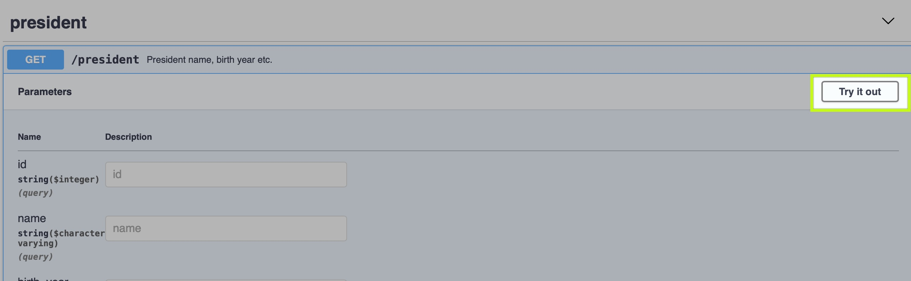
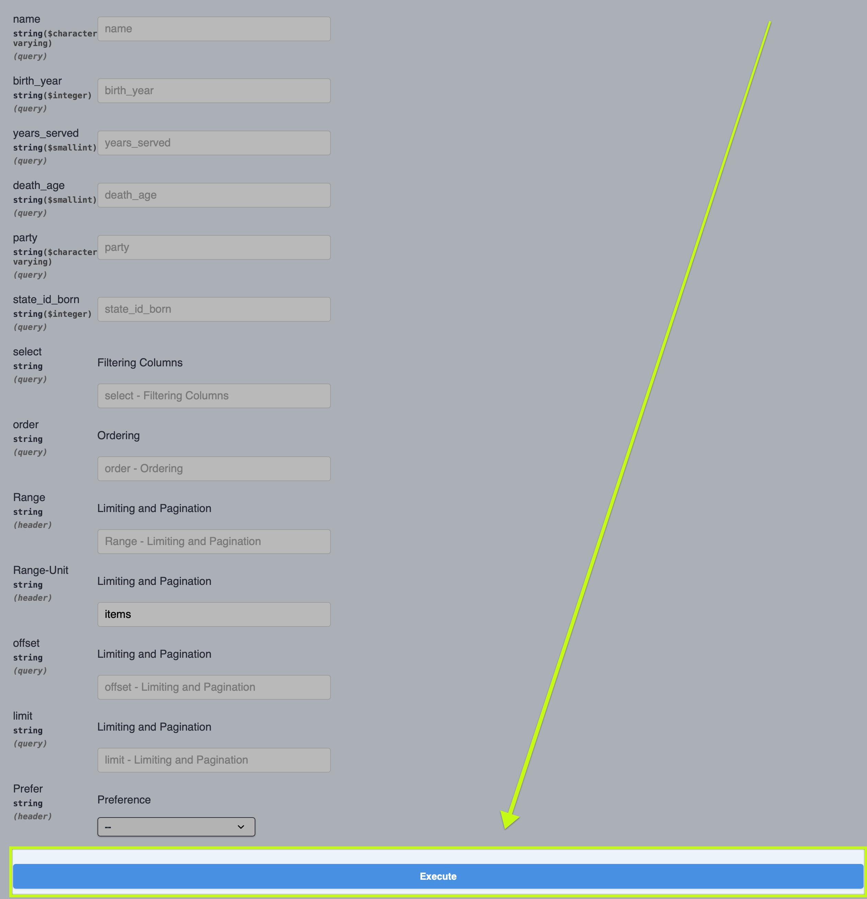
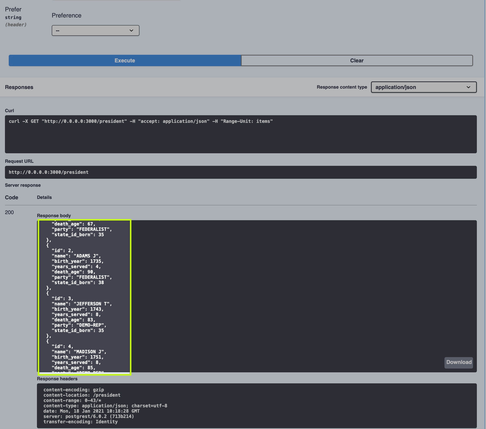

# Android introduction for project 4

Introduction to Android - PRJ4 course of Fontys Venlo

<!-- s -->

## Preparation

* Install android studio version (latest), see: [Android Studio](https://developer.android.com/studio)
* Read “Everything you need to build on Android”, see: [Android Studio features](https://developer.android.com/studio/features/)
* Read and execute this introduction tutorial, starting in Chapter 5 –up to 7.4 (gridlayout is deprecated), 9 and 10: [Android Tutorial starter](http://www.vogella.com/tutorials/Android/article.html#androidstudio_starter)
*  ⚠ How to put your local code into github, see: [import existing android app to github](import-existing-android-app-to-github.md)

<!-- s -->

## Assignment 1

* Individual deliverable, implement the following app: Based on constraint layout, this app should contain **3 rows of each 2 buttons and one image view**. If you click the first button then **same image should appear in the image view**, if you click the second button that image should change. Per row you should use different images, so in total you need 6 image resources.
More information about constraint layout you find in: [Layout information](https://developer.android.com/reference/android/support/constraint/ConstraintLayout)
<!-- s -->
* Next you *must commit the solution to your personal assignments repository*. Therefore you will receive an invitation link to join the assignment in github classroom. 

<!-- s -->

## Preparations

* Continue reading and executing the introduction tutorial, starting in Chapter 11 – 17.  
[Android tutorial](http://www.vogella.com/tutorials/Android/article.html#androidstudio_starter)
* List views more specific recycler views, read and execute: [Android Recycler View](http://www.vogella.com/tutorials/AndroidRecyclerView/article.html) 
Find out what a LayoutInflater is/does.
* For more background info on recycler views  see:
[Recycler view](https://developer.android.com/guide/topics/ui/layout/recyclerview)

<!-- s -->
## Assignment 2

* Individual deliverable, implement the following app: Based on the previous discussed recycler view, create an app which **displays a list of items, each item contains a picture, 2 text views and a checkbox**. Be sure to have enough pictures, one text view should contain a person’s name, the other one some additional text.  See example, but instead of date and o/p/n mark a checkbox, which controls background colour of the item, checked is red unchecked is green.<!-- s -->
* Recycler view uses the adapter pattern. According your Head First Design Pattern textbook this pattern comprises a client, target, adapter and adaptee. See the example discussed by A. Vogella, and indicate client, target, adapter and adaptee.<!-- s -->
* Describe when to use a LayoutInflater, describe typical situations where you could apply layout inflaters. <!-- s -->
* Make sure you do **all assignments from the Vogella Android tutorial!** which are 
* [Exercise first UI](https://www.vogella.com/tutorials/Android/article.html#exercise_first_ui_interface) 
* [Exercise add radio buttons](https://www.vogella.com/tutorials/Android/article.html#exercise-adding-radio-buttons) 
* [Exercise temperature converter](https://www.vogella.com/tutorials/Android/article.html#tutorialtemperature)

<!-- s -->

## Assignment 3

> Consume a local REST-API

<!-- s -->

### Preparation

For this assignment you will just run an easy REST-API based on the president database. This will be run locally!

<!-- s -->

For the setup, do the following steps:

* Clone: https://github.com/FontysVenlo/president-postgrest-restapi 

Start the application with:
```bash
docker-compose up
```

or 
```bash
docker-compose up -d
```

for daemon mode.

<!-- s -->

Goto http://localhost:8080 for your swagger api documentation.

The REST-API is available via http://localhost:3000

Now you are ready.

<!-- s -->

### Test your API with Swagger

- Goto your local [Swagger UI](http://localhost:8080/)
- Test your API if you want:



<!-- s -->

- Scroll down and click on execute:



<!-- s -->
- Scroll down and see the JSON result:



👍

<!-- s -->

### Assigment

- Create a UI and consume the REST-API under http://localhost:3000 to receive all the presidents.
- Show a list of all presidents in your Android App. 