# Import existing Android app to github

You have
a locally existing Android app (just newly created Android application from Android studio), see https://github.com/FontysVenlo/android-introduction of how to do that. 
already a new and (nearly) empty github repository on github, e.g. the github classroom assignment repository

Question is how can you now put your existing Android app code into your repository?

## Make a local Git repo

First of all, make a local git repository in Android studio.

### Enable Version Control Integration

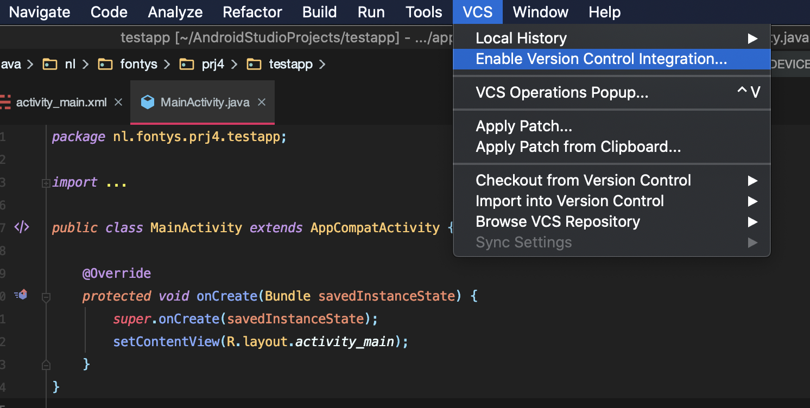

In the top menu of Android Studio, choose "Enable Version Control Integration".

### Choose Git

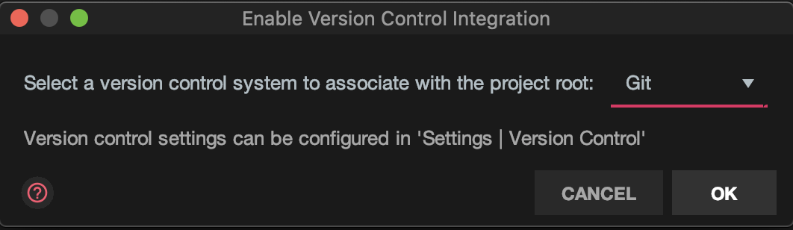

Choose GIT from the dropdown
Press OK

Now you have a local git repository.

### Commit all files

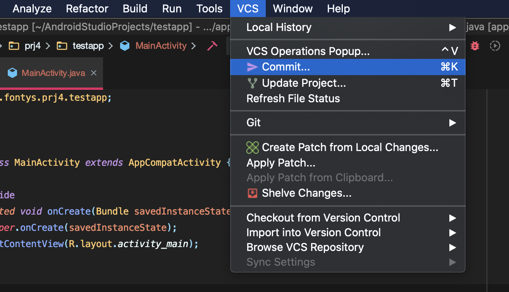

Choose in the top menu "VCS"
Click on "Commit" or use as shortcut Command+K or on Windows Control+K

### Add all files and commit

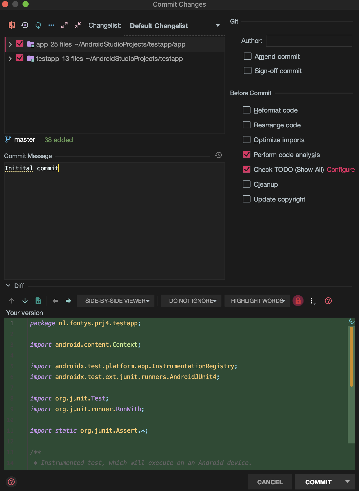

Add all files by clicking the checkbox 
Add a commit message
and press Commit-Button

Now all your files are locally under Version control thus in GIT (but not remote on a server)

## Connect local Git repository to remote Git repository

Now the local git repository must be connected to the already existing remote git repository. The remote git repository is the repo which most probably was created for your assignment, e.g. URL is probably something like https://github.com/FontysVenlo/PRJ4-assignment-xxxx

You have two options, do it via command line or do it via Android Studio only.

### Add remote via command line

- Open Shell/Bash/Command Line Tool

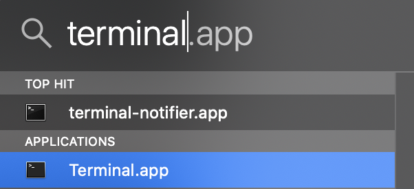

  Windows: open your command line tool by pressing Windows-key on your keyboard and then type "cmd" 
  press enter
  Mac: Open a terminal by pressing Command+Space and typing "terminal" to open the terminal.app
  press enter

- Goto the directory where your Android app is

  You can change the directory where your Android application code is by using the command on Mac:
  cd ..        for changing to upper directory
  cd Androidxxx     for changing to the directory named Androidxxx
  
  On Windows:
  
  cd..      for changing to upper directory
  cd Androidxxx     for changing to the directory named Androidxxx
  
  
  Show the content of the current directory in Windows: 
  dir
  
  Show the content of the current directory on Mac
  ls -la

	- Example on Mac

		- Show current path
		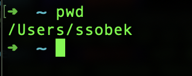
		- Show directory content
		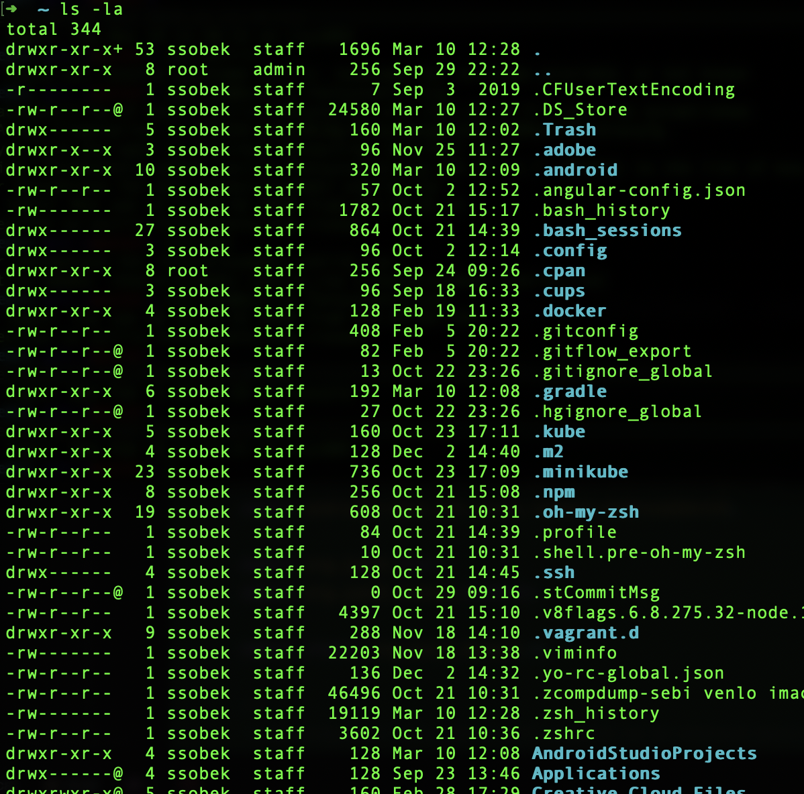
		- Change directory to Android projects directory
		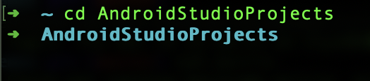
		- Show content of Android studio projects folder
		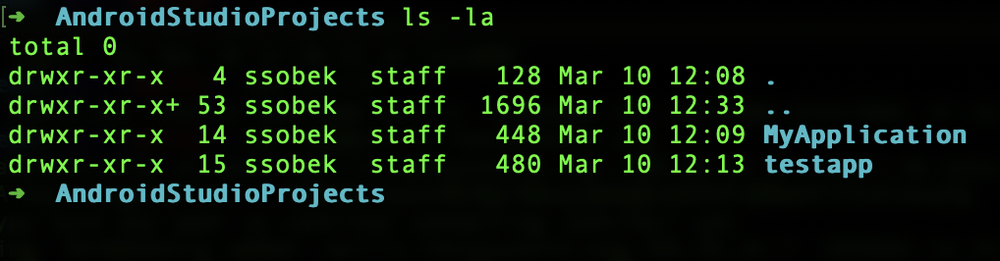
		- Goto your project folder
		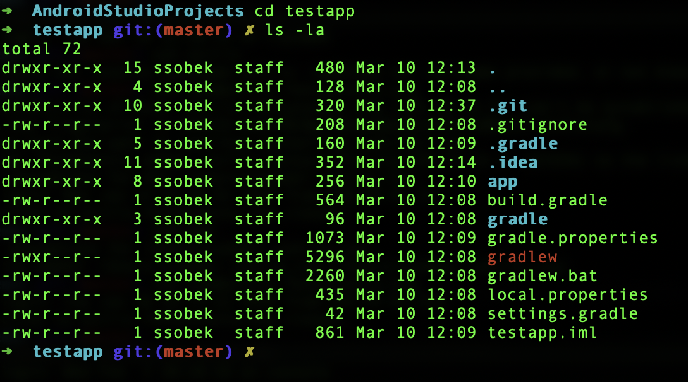
		- Look up your repository URL on github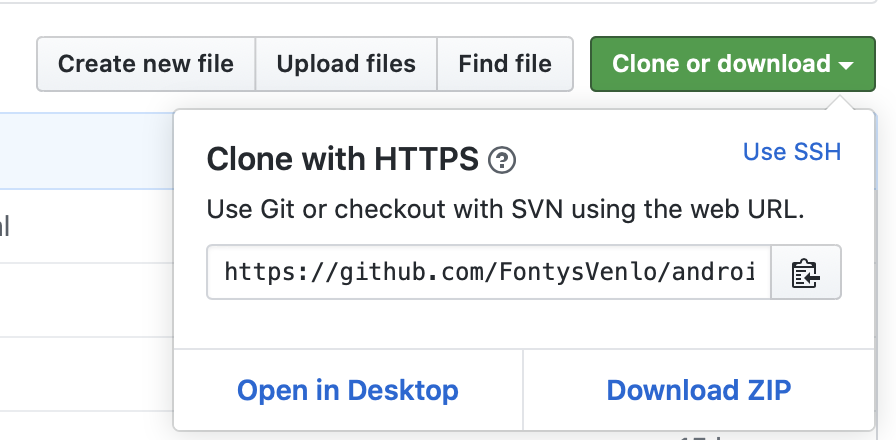

		  Open your repository online on git and click on the  button Clone or download. 
		  Copy this url
		  This one would most probably look like 
		  https://github.com/FontysVenlo/PRJ4-xxxx

		- Goto your bash/shell/terminal
		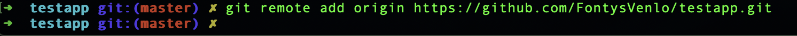

		  In your bash/shell/terminal you should now fill in the following commands:
		  
		  git remote add origin https://github.com/FontysVenlo/PRJ4-xxx.git
		  
		  git remote -v
		  
		  git push origin master

### Add remote via Android Studio

- Add remote repo url
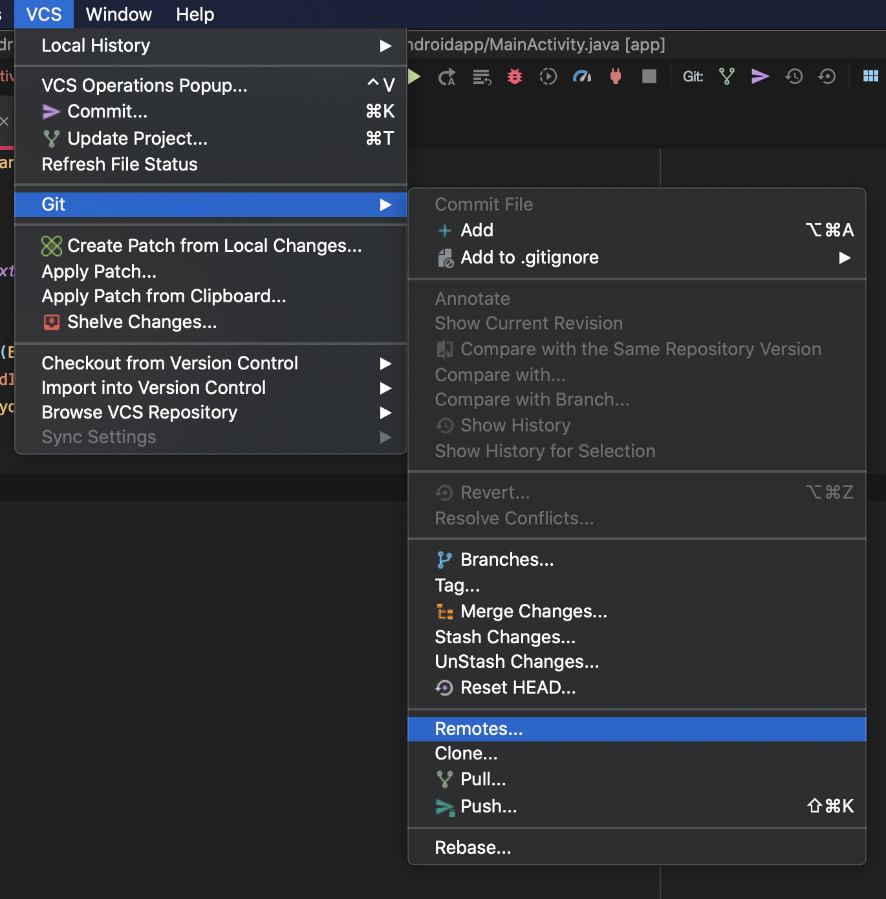
- Add the url from github
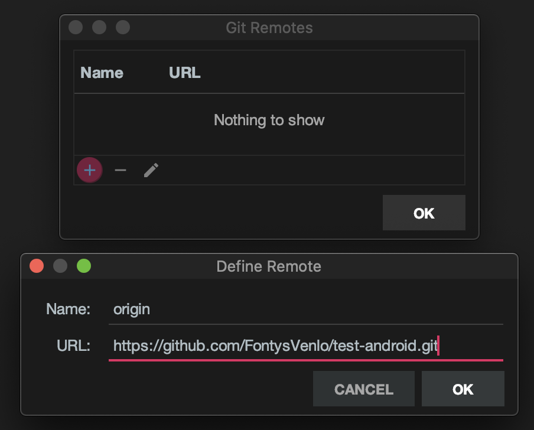
- Push all your changes

	- Choose VCS push in top menu
	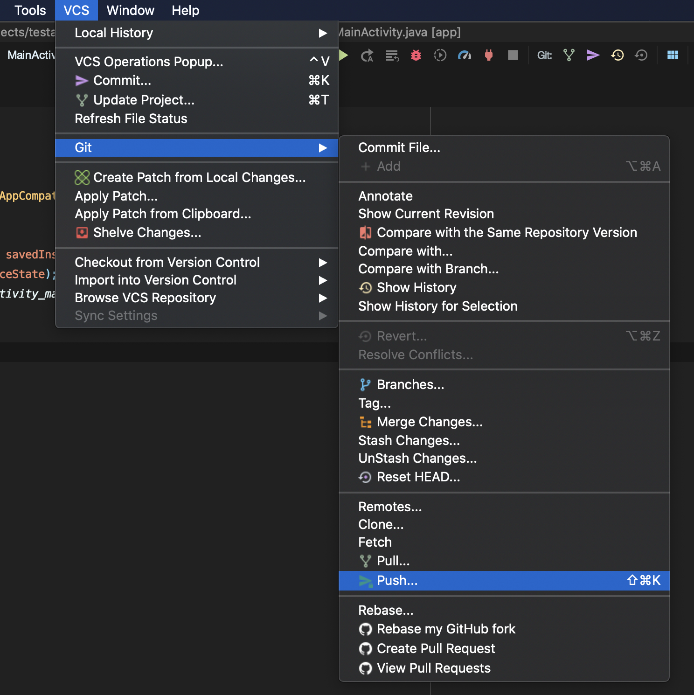
	- Push all your changes to remote git
	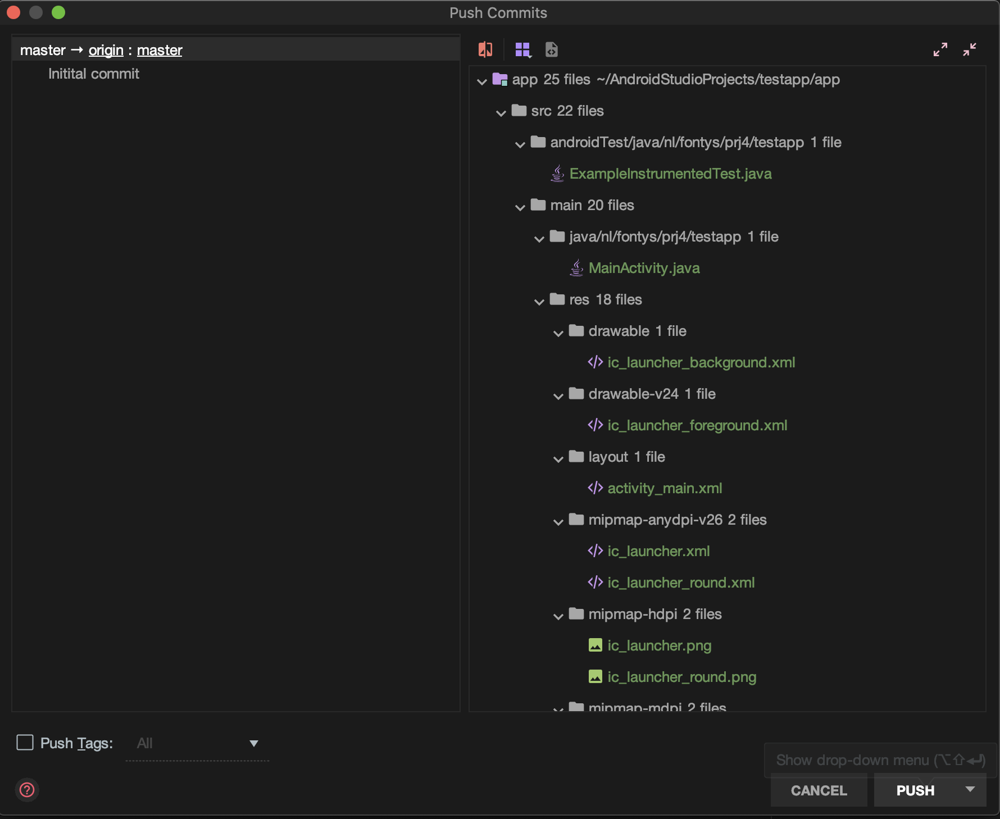

	  Click Push-button.

